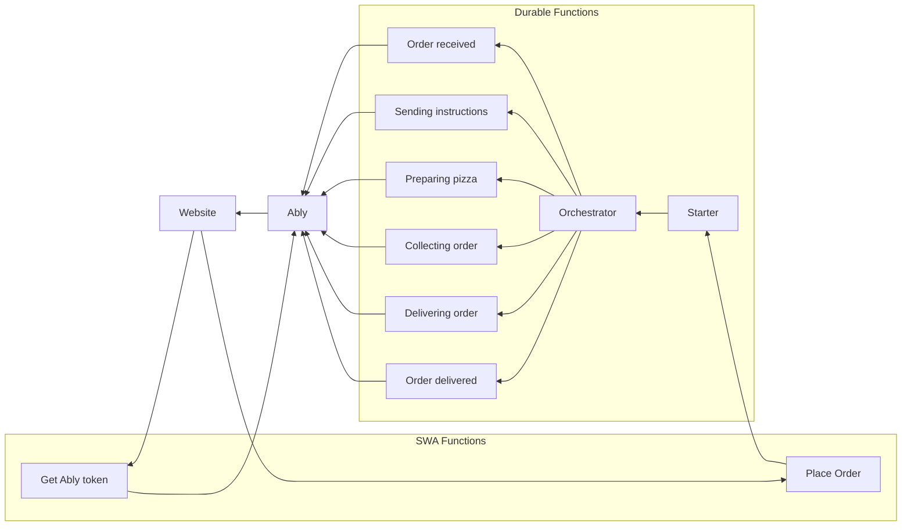

# Serverless Pizza Workflow Visualizer

A pizza-themed visualization of a serverless back-end process that uses pubsub to display the progress in realtime.

## Description

This repo contains a web application that visualizes the progress of a business process that has been implemented with serverless functions.

## Tech stack

The project uses the following components:

- [Azure Functions](https://docs.microsoft.com/azure/azure-functions/functions-overview), the serverless compute service in Azure.
- [Durable Functions](https://docs.microsoft.com/azure/azure-functions/durable/), an extension for Azure Functions that allows writing workflows as code and enables stateful functions.
- [Vue3](https://vuejs.org/), the frontend framework.
- [Azure Static Web Apps](https://docs.microsoft.com/azure/static-web-apps/overview), the hosting solution in the cloud.
- [Ably](https://ably.com/), the pubsub service for realtime messaging at scale.

This diagram show the various functions and their interactions:

## Running locally

You require the following dependencies:

- [.NET 6 SDK](https://dotnet.microsoft.com/download/dotnet/6.0). The .NET SDK required for the C# Azure Functions.
- [Node 16](https://nodejs.org/en/). The JavaScript runtime required for the Vue front-end.
- [Azure Functions Core Tools](https://docs.microsoft.com/azure/azure-functions/functions-run-local?tabs=v4%2Cwindows%2Ccsharp%2Cportal%2Cbash). This is part of the Azure Functions extensions for VSCode that should be recommended for automatic installation when this repo is opened in VSCode.
- [Azurite](https://marketplace.visualstudio.com/items?itemName=Azurite.azurite). This is an local storage emulator that is required for Entity Functions. When this repo is opened in VSCode a message will appear to install this extension.
- [Azure Static Web Apps CLI](https://github.com/Azure/static-web-apps-cli). Install this tool globally by running this command in the terminal: `npm install -g @azure/static-web-apps-cli`.
- A free Ably Account, [sign up](https://ably.com/signup) or [log in](https://ably.com/login) to ably.com, and [create a new app and copy the API key](https://faqs.ably.com/setting-up-and-managing-api-keys).
- Optional: The [Ably VSCode extension](https://marketplace.visualstudio.com/items?itemName=ably-labs.vscode-ably) to have easy access to the API keys of your Ably app.

There are two components in this solution that run independently from each other:

1. The back-end that runs the Durable Functions workflow (`PizzaWorkflow.csproj`).
2. The Static Web App that contains the front-end (a Vue3 project) and a function app (`Auth.csproj`).

In order to run and test the solution locally first start the PizzaWorkflow project, then the Static Web Apps project.

### Steps to run the PizzaWorkflow Function App

1. Run `dotnet restore` in the `api/PizzaWorkflow` folder to install the dependencies.
2. Rename the `api/PizzaWorkflow/local.settings.json.example` file to `api/PizzaWorkflow/local.settings.json`.
3. Copy/paste the Ably API key in the `ABLY_API_KEY` field in the `local.settings.json` file.
4. Start Azurite (VSCode: `CTRL+SHIFT+P -> Azurite: Start`).
5. Start the PizzaWorkflow function app by either pressing `F5` or running `func start` in the `api/PizzaWorkflow/` folder.

### Steps to run the Static Web Apps locally

1. Run `npm install` in the root folder to install the dependencies.
2. Rename the `api/Auth/local.settings.json.example` file to `api/Auth/local.settings.json`.
3. Copy/paste the Ably API key in the `ABLY_API_KEY` field in the `local.settings.json` file.
4. Run `swa start` in the root folder.

## Contributing

Want to help contributing to this project? Have a look at our [contributing guide](CONTRIBUTING.md)!

## More info

For more questions or comments, please contact me on our [Ably Discord](http://go.ably.com/discord) or reach out on [Twitter](https://twitter.com/marcduiker).

- [Join our Discord server](http://go.ably.com/discord)
- [Follow us on Twitter](https://twitter.com/ablyrealtime)
- [Use our SDKs](https://github.com/ably/)
- [Visit our website](https://ably.com)

---

